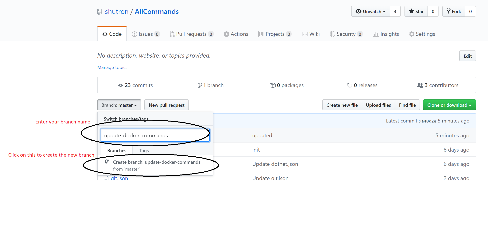
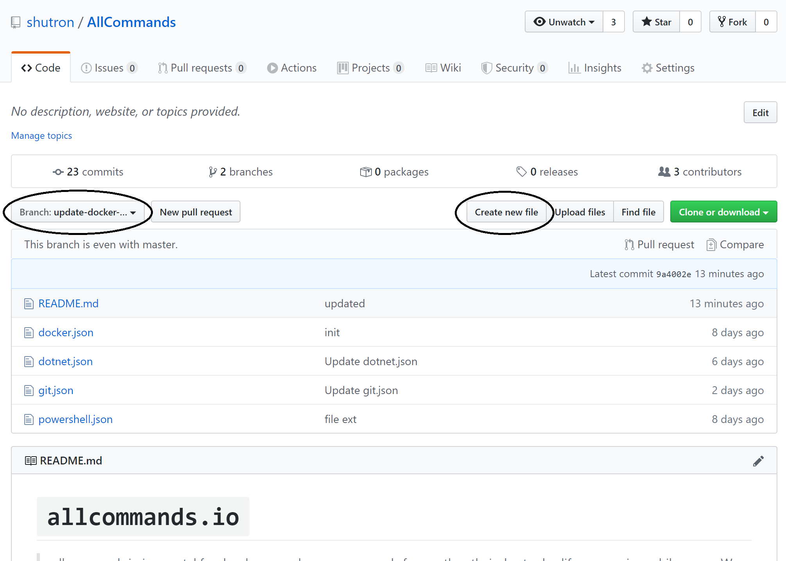
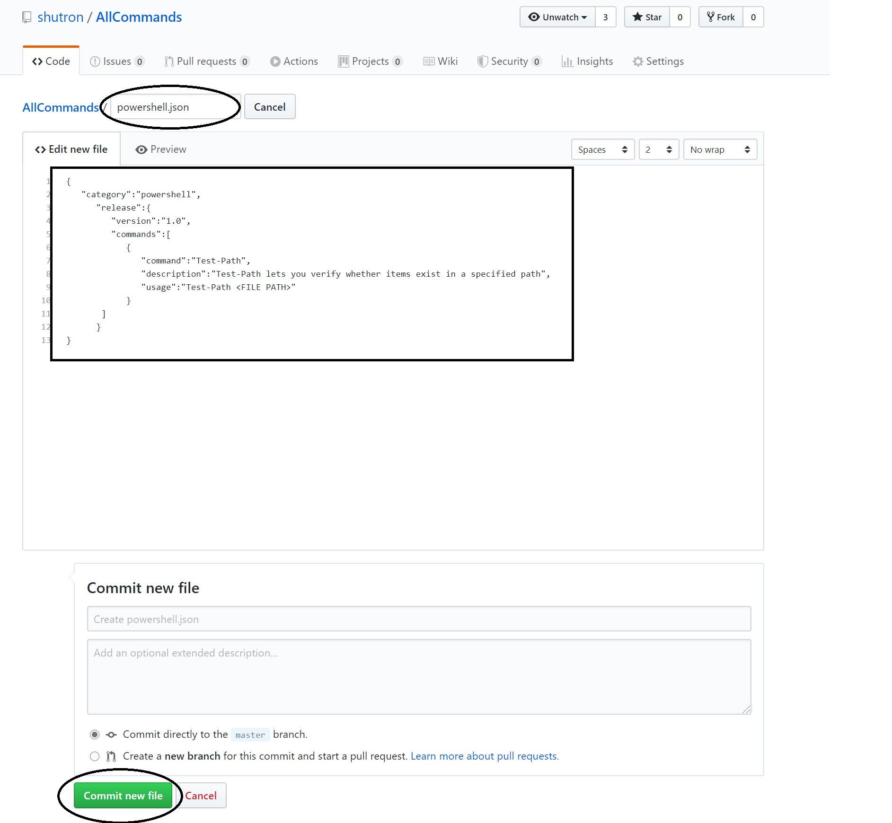
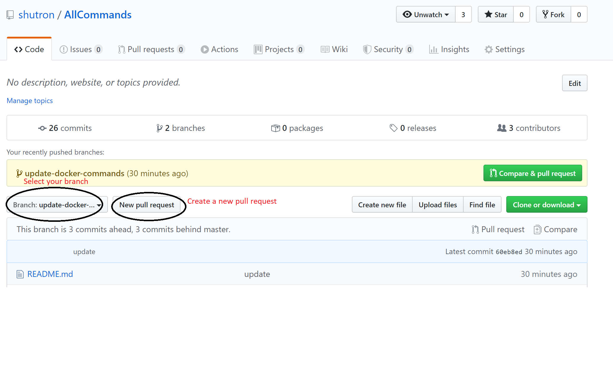
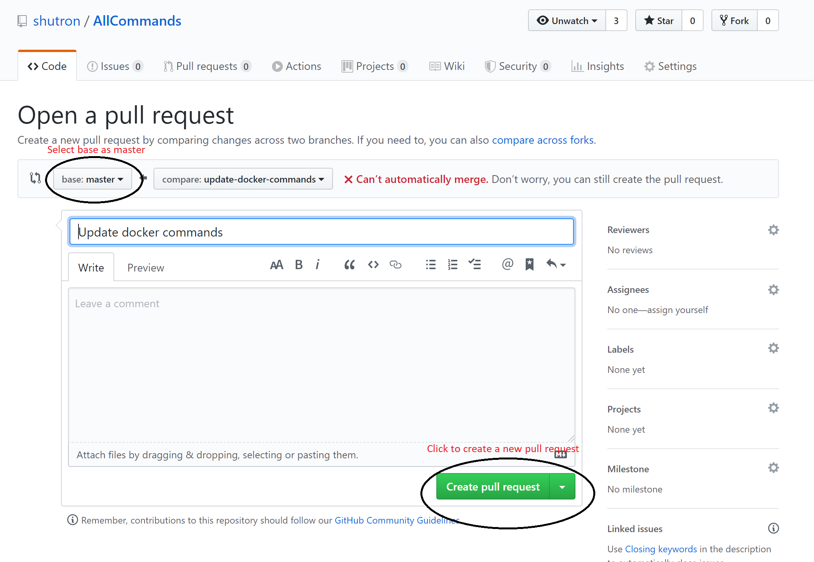

# `allcommands.io`
> allcommands.io is a portal for developers who use commands frequently in their day to day life or once in a while usage. We all forget syntax and need quick reference rather than going through the offical pages.  

  - This repo contains json file for each framework, tool, etc. which requires contribution
  - The repo for allcommands.io portal is [here](https://github.com/shutron/AllCommands.Portal). Feel free to contribute there as well 

# Setup
> This repo contains `.json` files for each framework/ tool (e.g. dotnet.json, docker.json, etc). Each of these `.json` files contains respective commands added by valuable contributer like you. There is another repo for the web application allcommands.io which is [here](https://github.com/shutron/AllCommands.Portal). The web app will read each of these `.json` files and display. Its simple as it is.  

# How To Contribute
> Its extremely simple to contribute. The follwing 3 steps is all needed to contribute. Each steps are explained with pictures.

If you are already familiar with git go ahead and do it your own way.

### Step 1. Create a branch from `master` branch
+ Go to allcommands [repositary](https://github.com/shutron/AllCommands)  and click on branch

+ Enter any sutiable branch name of your choice and click on create branch

+ Now you can see your newly created branch 

### Step 2. Add in new commands in the existing files / create new file for a new framework, tool and add in commands for that in the newly created branch
+ If you want to add commands for a framework/ tool which doesnt have `.json` file, 
    * Click on `Create new file`
    
    * Add your framework/ tool name. e.g. `powershell.json`
    * Add in your commands. (Please find [here](#JSON-format) for the file format)    
    * Commit new file
    
+ If you want to add more commands to an existing file
    * Click on the file (e.g. git.json)
    * Click on edit and add your new commands
    * Commit the changes

### Step 3. Create a `pull request` to master branch
+ Select your branch and click on `New pull request` button
  
+ add any comments (optional) and click on `Create pull request` button
  
  
That's all needed to contribute. One of the reviewers will merge it into the master and the commands will be visible in allcommands.io portal which will be used by many developers.


# JSON format

```json
{
   "category":"powershell",
      "release":{
         "version":"1.0",
         "commands":[
            {
               "command":"Test-Path",
               "description":"Test-Path lets you verify whether items exist in a specified path",
               "usage":"Test-Path <FILE PATH>"
            },
            {
               "command":"Start-Sleep",
               "description":"To suspend the activity in a script or session",
               "usage":"Start-Sleep -Seconds <Seconds>",
               "options":[
                  {
                     "value":"Seconds",
                     "description":"sleep in seconds",
                     "usage":"Start-Sleep -Seconds <Seconds>"
                  },
                  {
                     "value":"Milliseconds ",
                     "description":"sleep in milliseconds",
                     "usage":"Start-Sleep -Milliseconds <Milliseconds>"
                  }
               ]
            }   
       ]
      }
}
```
### JSON format Explained

Key  | Description
------------- | -------------
category  | The framework or tool (should be same as file name excl .json) 
release  |  
version  | Version number of document (retain it when updating or default to 1.0 when adding new) 
commands  | 
command  | Command name eg. git pull
description  | Describe what the command does
usage  | Example of the command usage 
options  | Array of options that come with the commands 
value  | The value of option eg. git pull origin master. Just have to put origin [branch name] 
description | Describe what the option does
usage  | Example of the command with option 


### TODO
- [ ] Login feature
- [ ] bookmark frequently used commands

### Feedback
allcommands.io is for developers by developers. Please feel free to raise issue in github or feel free to contact us via admin@shutron.com
